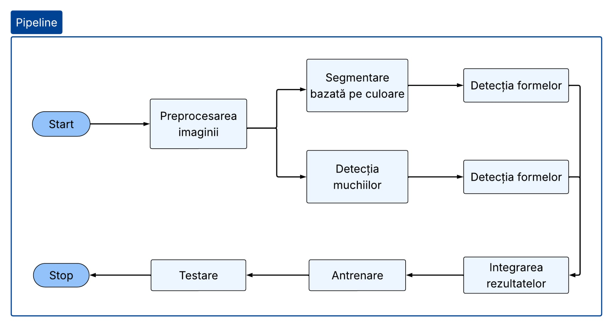
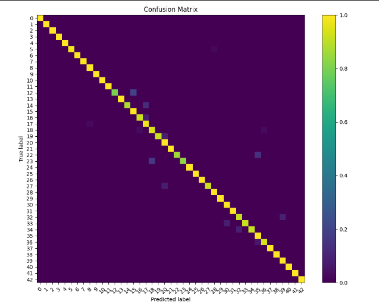

# Shape‑Based Traffic Sign / Symbol Recognition Suite

Proiect realizat de:
- Antal Simona
- Lisei Larisa-Claudia


## Descriere

Acest proiect implementează un sistem de detectare și recunoaștere a indicatoarelor rutiere din imagini, folosind metode clasice de procesare a imaginilor și machine learning. Sistemul combină analiza culorii, detecția muchiilor, detecția formelor geometrice și extragerea de caracteristici vizuale pentru clasificarea indicatoarelor în 43 de clase.

Proiectul urmărește atât identificarea formei generale a indicatorului, cât și clasificarea semnului rutier specific.


## Funcționalități principale

- Preprocesarea imaginilor prin redimensionare și egalizare de histogramă
- Segmentare pe culoare folosind măști HSV pentru roșu, albastru și galben
- Detecția muchiilor folosind Canny
- Detecția formelor prin aproximare poligonală
- Detecția cercurilor folosind Transformata Hough
- Extragerea caracteristicilor folosind:
  - Hu Moments
  - HOG
  - Histograme de culoare
- Clasificare cu SVM
- Evaluare folosind acuratețe, eroare medie pătratică și matrice de confuzie


## Structura proiectului

```text
Project/
│
├── code/
│   ├── __init__.py
│   ├── color.py
│   ├── descriptors.py
│   ├── model.py
│   ├── preprocessing.py
│   ├── shape.py
│   └── trained_svm.xml
│
└── DATA/
    ├── TRAIN/
    ├── demo.mp4
    └── labels.csv
```

### Folderul `code/`

Folderul `code/` conține codul sursă al aplicației.

| Fișier | Descriere                                                                                                                                      |
|---|------------------------------------------------------------------------------------------------------------------------------------------------|
| `__init__.py` | Marchează folderul `code` ca pachet Python.                                                                                                    |
| `color.py` | Conține funcții pentru segmentarea imaginilor pe baza culorii, folosind măști HSV pentru culorile specifice indicatoarelor rutiere.            |
| `descriptors.py` | Conține funcții pentru extragerea caracteristicilor vizuale, precum Hu Moments, HOG și histograma de culoare.                                  |
| `model.py` | Include funcții pentru colectarea datelor, antrenarea modelului SVM, predicție, evaluare, calculul erorilor și generarea matricei de confuzie. |
| `preprocessing.py` | Realizează redimensionarea imaginilor, conversia de culoare și egalizarea histogramei.                                                         |
| `shape.py` | Conține funcții pentru detecția formelor geometrice, folosind contururi, aproximare poligonală și Transformata Hough pentru cercuri.           |
| `trained_svm.xml` | Reprezintă parametrii modelului SVM antrenat.                                                      |

### Folderul `DATA/`

Folderul `DATA/` conține datele folosite pentru antrenare, testare și demonstrații.

| Fișier / Folder | Descriere |
|---|---|
| `TRAIN/` | Conține imaginile de antrenare, organizate pe clase de indicatoare. |
| `demo.mp4` | Videoclip demo folosit pentru testarea sistemului pe secvențe video. |
| `labels.csv` | Conține corespondența dintre clasele numerice, denumirile indicatoarelor și forma geometrică asociată. |


## Tehnologii utilizate

- Python
- OpenCV
- NumPy
- scikit-learn
- Matplotlib


## Instalare și rulare

### 1. Clonarea proiectului

```bash
git clone https://github.com/SVA-2026/sva-project-echipa3_1409a.git
cd sva-project-echipa3_1409a
```

### 2. Crearea mediului virtual

```bash
python -m venv .venv
```

Activarea mediului virtual:

**Windows:**

```bash
.venv\Scripts\activate
```

**Linux:**

```bash
source .venv/bin/activate
```

### 3. Instalarea dependențelor

```bash
pip install opencv-python numpy scikit-learn matplotlib pandas
```

### 4. Rularea proiectului

Din folderul principal al proiectului, se rulează:

```bash
python code/__init__.py
```

## Pipeline-ul aplicației



## Dataset

Dataset-ul utilizat conține 43 de clase de indicatoare rutiere, fiecare clasă având aproximativ 40–200 de imagini. Imaginile includ condiții variate de iluminare, perspectivă, rotație și scară.

Datele au fost împărțite separat pentru fiecare clasă:
- 80% pentru antrenare
- 20% pentru testare

Această împărțire permite păstrarea unei distribuții echilibrate a claselor în ambele seturi.

## Forme detectate

Deși clasificarea finală se face pe 43 de clase, după indicatoar e specifice, sistemul folosește patru categorii geometrice principale:

- Cerc
- Patrulater
- Triunghi
- Octogon

## Rezultate

Modelul final a obținut următoarele rezultate:

| Metrică | Rezultat |
|---|---|
| Acuratețe | 0.9804 |
| Eroare de clasificare | 0.0195 |
| Eroare medie pătratică | 1.4080 |

Rezultatele per formă au fost:

| Formă | Hits | Total |
|---|-----:|------:|
| Cerc |  562 |   566 |
| Patrulater |   44 |    46 |
| Triunghi |  136 |   145 |
| Octogon |   10 |    10 |

Matricea de confuzie pentru cele 43 de clase:



## Analiza modelului SVM

Au fost testate mai multe configurații pentru clasificatorul SVM. Cea mai bună configurație a fost obținută folosind:

- Kernel: RBF
- C: 100
- Gamma: 0.001
- Acuratețe: 0.9804

## Limitări

Sistemul poate avea dificultăți în următoarele situații:

- imagini cu iluminare slabă;
- indicatoare parțial obturate;
- forme sau culori foarte asemănătoare între clase;
- obiecte irelevante care nu sunt eliminate corect în etapa de segmentare;
- clase slab reprezentate în dataset.

## Posibile îmbunătățiri

- ``Echilibrarea dataset-ului pentru toate clasele
- Adăugarea mai multor imagini pentru clasele cu puține exemple
- Integrarea unui model deep learning
- Îmbunătățirea segmentării pentru condiții dificile de iluminare``

## Concluzie

Proiectul demonstrează că indicatoarele rutiere pot fi recunoscute eficient prin 
combinarea metodelor clasice de computer vision cu un clasificator SVM. 
Principalele limitări apar în detecția indicatoarelor (sunt detectate și alte obiecte
daca au forme sau culori asemănătoare indicatoarelor)

